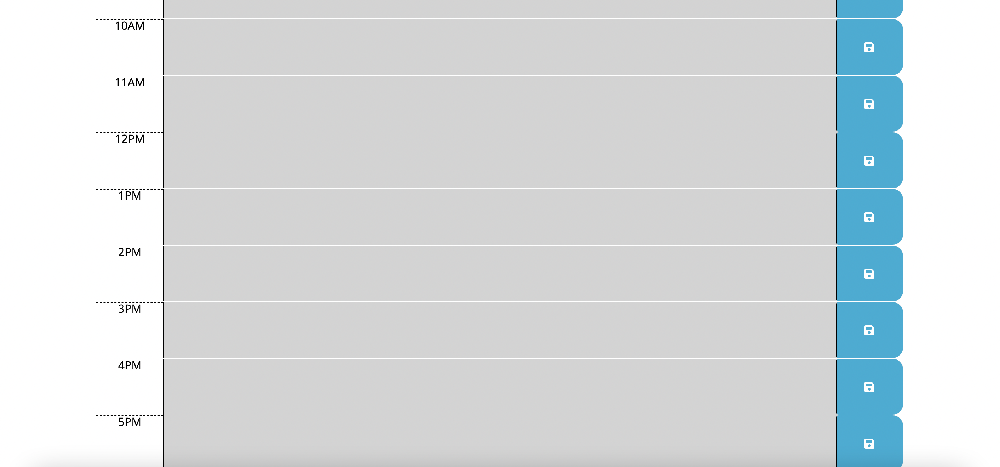

<!-- PROJECT SHIELDS -->
<!--
*** I'm using markdown "reference style" links for readability.
*** Reference links are enclosed in brackets [ ] instead of parentheses ( ).
*** See the bottom of this document for the declaration of the reference variables
*** for contributors-url, forks-url, etc. This is an optional, concise syntax you may use.
*** https://www.markdownguide.org/basic-syntax/#reference-style-links
-->
[![Contributors][contributors-shield]][contributors-url]
[![Forks][forks-shield]][forks-url]
[![Stargazers][stars-shield]][stars-url]
[![Issues][issues-shield]][issues-url]


<!-- PROJECT LOGO -->
<br />
<p align="center">
  <a href="https://github.com/jsun994/work-day-scheduler">
    
  </a>

  <h3 align="center">Work Day Scheduler</h3>

  <p align="center">
  A daily planner application to help manage time effectively.
    <br />
    <a href="https://github.com/jsun994/work-day-scheduler"><strong>Explore the docs »</strong></a>
    <br />
    <br />
    <a href="https://jsun994.github.io/work-day-scheduler/">View Demo</a>
    ·
    <a href="https://github.com/jsun994/work-day-scheduler/issues">Report Bug</a>
    ·
    <a href="https://github.com/jsun994/work-day-scheduler/issues">Request Feature</a>
  </p>
</p>


<!-- TABLE OF CONTENTS -->
<details open="open">
  <summary><h2 style="display: inline-block">Table of Contents</h2></summary>
  <ol>
    <li>
      <a href="#about-the-project">About The Project</a>
      <ul>
        <li><a href="#built-with">Built With</a></li>
      </ul>
    </li>
    <li>
      <a href="#getting-started">Getting Started</a>
      <ul>
        <li><a href="#prerequisites">Prerequisites</a></li>
        <li><a href="#installation">Installation</a></li>
      </ul>
    </li>
    <li><a href="#usage">Usage</a></li>
    <li><a href="#roadmap">Roadmap</a></li>
    <li><a href="#contributing">Contributing</a></li>
    <li><a href="#contact">Contact</a></li>
  </ol>
</details>


<!-- ABOUT THE PROJECT -->
## About The Project





### Built With

* HTML
* CSS
* JS


<!-- GETTING STARTED -->
## Getting Started

To get a local copy up and running follow these simple steps.

### Prerequisites

This is an example of how to list things you need to use the software and how to install them.
* npm
  ```sh
  npm install npm@latest -g
  ```

### Installation

1. Clone the repo
   ```sh
   git clone git@github.com:jsun994/work-day-scheduler.git
   ```
2. Install NPM packages
   ```sh
   npm install
   ```


<!-- USAGE EXAMPLES -->
## Usage

* The user uses the daily planner to create a work schedule.
* The current day is displayed at the top.
* The user is presented with time blocks for standard business hours 9-5.
* The time blocks are colored to indicate the past, present or future.
* The user clicks into a time block & enters an event to save.
* Once saved, the user can refresh the page and events will load.
* The user can clear all events.


<!-- ROADMAP -->
## Roadmap

See the [open issues](https://github.com/jsun994/work-day-scheduler/issues) for a list of proposed features (and known issues).


<!-- CONTRIBUTING -->
## Contributing


1. Fork the Project
2. Create your Feature Branch (`git checkout -b feature/AmazingFeature`)
3. Commit your Changes (`git commit -m 'Add some AmazingFeature'`)
4. Push to the Branch (`git push origin feature/AmazingFeature`)
5. Open a Pull Request


<!-- CONTACT -->
## Contact

Your Name - jaysun054@gmail.com

Project Link: [https://github.com/jsun994/work-day-scheduler](https://github.com/jsun994/work-day-scheduler)


<!-- MARKDOWN LINKS & IMAGES -->
<!-- https://www.markdownguide.org/basic-syntax/#reference-style-links -->
[contributors-shield]: https://img.shields.io/github/contributors/github_username/repo.svg?style=for-the-badge
[contributors-url]: https://github.com/jsun994/work-day-scheduler/graphs/contributors
[forks-shield]: https://img.shields.io/github/forks/github_username/repo.svg?style=for-the-badge
[forks-url]: https://github.com/jsun994/work-day-scheduler/network/members
[stars-shield]: https://img.shields.io/github/stars/github_username/repo.svg?style=for-the-badge
[stars-url]: https://github.com/jsun994/work-day-scheduler/stargazers
[issues-shield]: https://img.shields.io/github/issues/github_username/repo.svg?style=for-the-badge
[issues-url]: https://github.com/jsun994/work-day-scheduler/issues