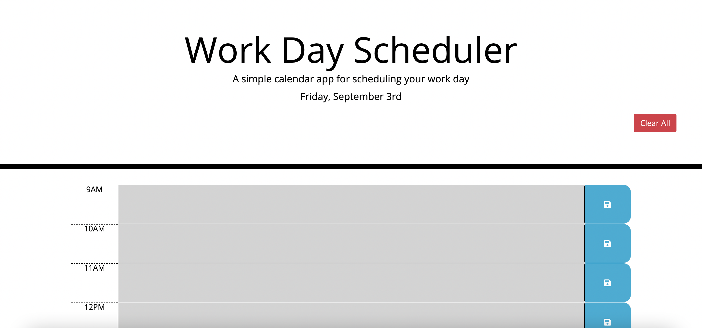

# Work Day Scheduler

## Purpose
A daily planner application to help manage time effectively.

## Built With
* HTML
* CSS
* JS

## Website
https://jsun994.github.io/work-day-scheduler/

## Description
The user uses the daily planner to create a work schedule.
The current day is displayed at the top.
The user is presented with time blocks for standard business hours 9-5.
The time blocks are colored to indicate the past, present or future.
The user clicks into a time block & enters an event to save.
Once saved, the user can refresh the page and events will load.
The user can clear all events.

